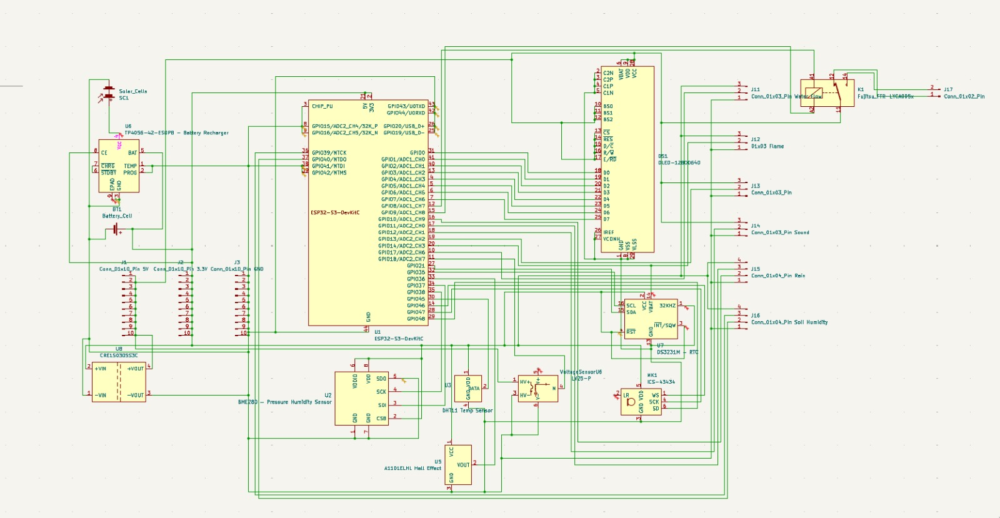

# Hardware Hackathon - IoT for Urban Management

This repository contains all resources for our hardware hackathon project that implements an IoT system for urban management.

[Documentation](pcb/src/ERGA%20LABS.docx)
[PPT](pcb/src/erga%20labs.pptx)

## Project Structure

### PCB Design

- **Source Files**: [pcb/src/](pcb/src/)
  - [KiCad Schematic](pcb/src/testing.kicad_sch)
  - [KiCad PCB Layout](pcb/src/testing.kicad_pcb)
  - [Bill of Materials](pcb/src/bill-of-materials.csv)
  - [Gerber Files](pcb/src/gerber-files.zip) (manufacturing files)

### PCB Output & Documentation

- **Renders and Verification**: [pcb/output/](pcb/output/)
  - [Complete PCB Layout](pcb/output/complete_pcb_layout.jpeg)
  - [Schematic Diagram](pcb/output/schematic.jpeg)
  - [Top Copper Layer](pcb/output/top_copper.jpeg)
  - [Bottom Copper Layer](pcb/output/bottom_copper.jpeg)
  - [3D Representation](pcb/output/3d_representation.jpeg)
  - [Design Rule Check Results](pcb/output/design_rule_cheker.jpeg)
  - [Electrical Rule Check Results](pcb/output/electrical_rule_checker.jpeg)

### 3D Models

- **Enclosure Design**: [pcb/3D_CAD_Model/](pcb/3D_CAD_Model/)
  - [3D Model Preview](pcb/3D_CAD_Model/3d%20model.PNG)
  - [OBJ File](pcb/3D_CAD_Model/pcb%20bOX%20v1.obj)
  - [Material File](pcb/3D_CAD_Model/pcb%20bOX%20v1.mtl)

### User Interface

- **Dashboard Design**: [ui/dashboard.jpeg](ui/dashboard.jpeg)

### Hardware Requirements

- List of components (refer to [Bill of Materials](pcb/src/bill-of-materials.csv))

## Team Members

- Nishumbh Shah
- Dev Tangadi
- Hamza Murghay
- Tejas Bhovad
- Satish Singh
- Pranavi Shukla
